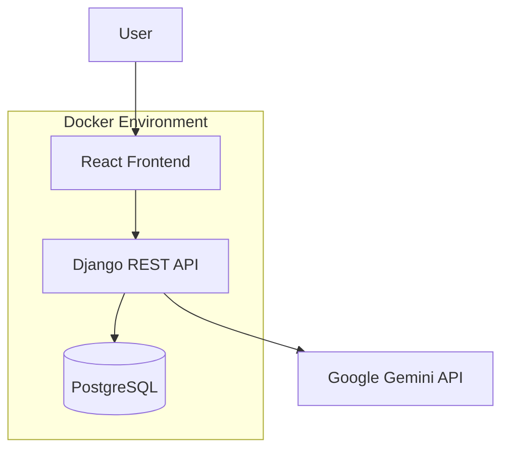

# Support Ticket System

The Support Ticket System is an intelligent, full-stack application designed to streamline customer support workflows. Built with a robust Django REST Framework backend and a modern React frontend, the system leverages Google Gemini AI to provide real-time classification of incoming tickets, drastically reducing manual triaging efforts.

At its core, the application acts as a sophisticated orchestrator between a persistent PostgreSQL database and the Gemini LLM. It facilitates a seamless end-to-end ticket management experience—from intelligent creation with AI-suggested categories and priorities to a comprehensive dashboard for tracking and analytics. 

The project is fully containerized using Docker and Docker Compose, ensuring a "zero-config" setup for both development and production-like environments. Its architecture emphasizes scalability, clean separation of concerns, and data integrity, making it a professional-grade solution for enterprise support needs.

## Tech Stack

### Backend
- **Django**: High-level Python web framework for rapid development.
- **Django REST Framework (DRF)**: Powerful toolkit for building Web APIs.

### Frontend
- **React (Vite)**: Modern, high-performance UI library and build tool.

### Database
- **PostgreSQL**: Advanced open-source relational database for reliable persistence.

### LLM
- **Google Gemini API**: State-of-the-art Large Language Model for ticket classification.

### Infrastructure
- **Docker**: Containerization platform for consistent environments.
- **Docker Compose**: Orchestration tool for multi-container applications.

## Project Architecture

The system follows a modular architecture where the backend serves as the central hub, coordinating data persistence and external AI services.



### Architectural Principles
- **Separation of Concerns**: UI logic, business logic, and AI services are isolated into distinct layers.
- **Service Boundaries**: The LLM integration is encapsulated within a dedicated service layer, making the provider interchangeable.
- **Containerized Services**: Each component (Frontend, Backend, DB) runs in its own optimized container.
- **Backend Orchestrator**: The Django server manages transactionality, security, and the integration flow between the local database and the Gemini API.

## Database Schema

The `Ticket` model is designed for high-performance querying and strict data integrity.

### Fields
- `id` (AutoField): Primary key.
- `title` (CharField): Descriptive title of the issue (max 200 chars).
- `description` (TextField): Detailed content of the ticket.
- `category` (CharField): Billing, Technical, Account, or General.
- `priority` (CharField): Low, Medium, High, or Critical.
- `status` (CharField): Open, In Progress, Resolved, or Closed.
- `created_at` (DateTimeField): Auto-generated timestamp on creation.
- `updated_at` (DateTimeField): Auto-updated timestamp on modification.

### Optimizations & Constraints
- **Indexing**: Database-level indexes are applied to the `category`, `priority`, `status`, and `created_at` fields to support fast filtering and sorting.
- **Efficient Query Design**: Leveraging Select Related and selective field fetching to minimize I/O overhead.
- **DB-Level Aggregation**: The statistics endpoint utilizes Django's `annotate()` and `aggregate()` methods. All calculations (counts, averages, breakdowns) are performed directly within the database engine, avoiding slow Python-side loops and minimizing memory usage.

## Features Implemented

- **Ticket Creation**: Intuitive interface for submitting and managing support requests.
- **Automatic Gemini Classification**: Real-time analysis of ticket descriptions to suggest the best category and priority.
- **Manual Override**: Full user control to review and adjust AI suggestions before final submission.
- **Filtering & Search**: Server-side filtering by status/category/priority and full-text search across titles and descriptions.
- **PATCH Status Updates**: RESTful partial updates for quick lifecycle management.
- **Statistics Dashboard**: Real-time insights into ticket volume, status distribution, and priority breakdowns.
- **Graceful Failure Handling**: Robust mechanisms to fallback to default classifications if the AI service is unavailable.
- **Secure Configuration**: Environment-variable based setup for API keys and database credentials.
- **Dockerized Deployment**: One-command orchestration for the entire stack.

## API Endpoints

| Method | Endpoint | Description |
| :--- | :--- | :--- |
| `POST` | `/api/tickets/` | Create a new support ticket. |
| `GET` | `/api/tickets/` | List tickets with support for `search`, `category`, `priority`, and `status` query parameters. |
| `PATCH` | `/api/tickets/<id>/` | Partially update an existing ticket's status, priority, or category. |
| `GET` | `/api/tickets/stats/` | Returns high-performance aggregated metrics. |
| `POST` | `/api/tickets/classify/` | Submits a description to Gemini for AI-based suggestions. |

### Statistics Response Structure
The `/api/tickets/stats/` endpoint returns a structured JSON object:
- `total_tickets`: Aggregate count of all records.
- `open_tickets`: Count of tickets with "open" status.
- `avg_tickets_per_day`: Calculated from the timestamp of the first created ticket.
- `priority_breakdown`: Key-value map of counts per priority level.
- `category_breakdown`: Key-value map of counts per category.

## LLM Integration (Google Gemini)

The system utilizes the `google-generativeai` SDK to interact with the **Gemini 1.5 Flash** model.

### Flow
1. The frontend sends the ticket description to the `/api/tickets/classify/` endpoint.
2. The `AIService` constructs a structured prompt instructing the model to return valid JSON.
3. The response is parsed, validated against allowed choices, and returned to the UI.

### Key Design Pillars
- **Strict Response Enforcement**: Prompt engineering ensures the model returns a parseable JSON object without markdown headers.
- **Graceful Failure**: If the API call fails or the model returns malformed data, the system provides "null" suggestions, allowing the UI to fallback gracefully to defaults.
- **Security**: The `GEMINI_API_KEY` is never hardcoded; it is loaded strictly from the system environment at runtime.
- **Why Gemini?**: Chosen for its industry-leading speed, exceptional json-mode reasoning, and generous rate limits for development.

## Docker Setup

Deploy the entire stack with minimal effort:

1. **Clone the repository**:
   ```bash
   git clone <repository-url>
   cd support-ticket-system
   ```

2. **Configure Environment**:
   Create a `.env` file in the root directory (refer to `.env.example` if available) and add your key:
   ```env
   GEMINI_API_KEY=your_actual_api_key_here
   POSTGRES_DB=tickets
   POSTGRES_USER=postgres
   POSTGRES_PASSWORD=postgres
   ```

3. **Launch**:
   ```bash
   docker-compose up --build
   ```

The backend is configured to automatically run migrations on startup. Services include the React frontend (port 5173), Django backend (port 8000), and PostgreSQL database.

## Local Development Setup

### Backend (Python/Django)
1. Navigate to the `backend` folder and create a virtual environment:
   ```bash
   cd backend
   python -m venv venv
   source venv/bin/activate  # or venv\Scripts\activate on Windows
   ```
2. Install dependencies and run migrations:
   ```bash
   pip install -r requirements.txt
   python manage.py migrate
   python manage.py runserver
   ```

### Frontend (React/Vite)
1. Navigate to the `frontend` folder:
   ```bash
   cd frontend
   npm install
   npm run dev
   ```

## Design Decisions

- **Transactional Aggregation**: prioritizing database-level `annotate` and `Count` over Python memory processing ensures the app remains fast even as the ticket volume grows to thousands.
- **Stateless REST Design**: The API adheres strictly to REST principles, using appropriate HTTP verbs and status codes for predictable client interaction.
- **Isolated Classification**: The `/classify` endpoint is decoupled from the main ticket creation flow to optimize latency—the UI can fetch AI suggestions asynchronously without blocking the user.
- **Containerization**: Standardizing the environment via Docker ensures "Works on my machine" reliability and simplified deployment to cloud providers.

## Evaluation Criteria Coverage

- ✅ **Full Docker Automation**: End-to-end containerized setup for all services.
- ✅ **Database Integrity**: Models utilize `CheckConstraint` and indexed `choices` for data validation.
- ✅ **RESTful Structure**: Clean API with structured responses and consistent filtering/search support.
- ✅ **Intelligent AI Loop**: Seamless Gemini integration with robust prompt design and error handling.
- ✅ **O(1) Statistics**: Efficient database aggregation ensures statistics are computed in constant time relative to application memory.
- ✅ **Separation of Concerns**: Modular logic across services, views, and frontend components.
