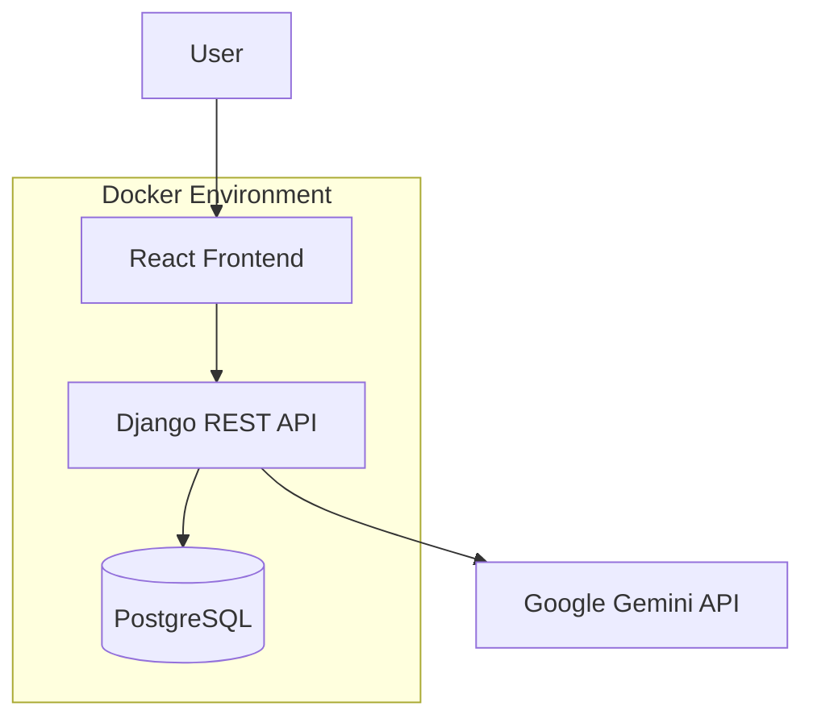

# Support Ticket System

The Support Ticket System is an intelligent, full-stack application designed to streamline customer support workflows through automated triage and data-driven insights. Built with a robust Django REST Framework backend and a modern React frontend, the system leverages the Google Gemini API to provide real-time classification of incoming tickets, significantly reducing the manual overhead of support operations.

The application serves as a sophisticated orchestrator, managing seamless communication between a persistent PostgreSQL database and advanced Large Language Models. It features a RESTful API architecture that supports complex filtering, full-text search, and database-level performance optimizations. The entire project is fully containerized using Docker and Docker Compose, ensuring consistent deployment and high portability across diverse environments.

With a strong emphasis on clean code and separation of concerns, the system is designed to handle ticket lifecycles from creation to resolution. It includes features such as AI-suggested priorities, manual override capabilities for human-in-the-loop validation, and detailed statistical analytics computed directly at the database layer to ensure scalability and speed.

## Tech Stack

### Backend
- **Django**: High-level Python web framework.
- **Django REST Framework**: Toolkit for building powerful Web APIs.

### Frontend
- **React (Vite)**: High-performance UI library and modern build tool.

### Database
- **PostgreSQL**: Advanced relational database for reliable data persistence.

### LLM
- **Google Gemini API**: State-of-the-art AI for text classification.

### Infrastructure
- **Docker & Docker Compose**: Containerization and multi-container orchestration.

## Project Architecture

The system follows a modular architecture where the backend acts as the central hub for data management and external service integration.



- **Backend Orchestration**: The Django server coordinates all transactions, managing the state between the local PostgreSQL database and the stateless Gemini API.
- **Frontend Isolation**: The React frontend communicates exclusively with the backend API, keeping all business logic and sensitive AI configurations on the server side.
- **Containerized Services**: Each service runs in its own isolated environment with dedicated networking, ensuring zero dependency conflicts.

## Database Schema

The `Ticket` model is engineered for high performance and strict data integrity, utilizing internal Django optimizations and database-level constraints.

### Fields
- **id** (AutoField): Unique identifier.
- **title** (CharField): Concise summary of the issue.
- **description** (TextField): Detailed content of the support request.
- **category**: choices: `billing`, `technical`, `account`, `general`.
- **priority**: choices: `low`, `medium`, `high`, `critical`.
- **status**: choices: `open`, `in_progress`, `resolved`, `closed`.
- **created_at** (DateTimeField): Auto-generated timestamp on creation.

### Performance & Design
- **Indexing**: Database-level indexes are applied to the `category`, `priority`, `status`, and `created_at` fields to support rapid filtering and sorting at scale.
- **Efficient Querying**: The API uses optimized QuerySets to minimize database I/O.
- **Database-Level Aggregation**: All statistics (totals, counts, and averages) are computed using the Django ORM's `aggregate()` and `annotate()` methods. This ensures that heavy calculations happen within the database engine rather than through expensive Python-side loops.

## Features Implemented

- **Ticket Creation**: User-friendly form for submitting new support requests.
- **Automatic Gemini Classification**: Real-time AI analysis of ticket descriptions to suggest categories and priorities.
- **Manual Override**: Allows support staff to human-verify and override LLM suggestions before saving.
- **Advanced Filtering**: Server-side filtering by category, priority, and status variables.
- **Global Search**: Search functionality covering both ticket titles and descriptions.
- **Partial Updates**: PATCH endpoint for quick updates to ticket status or priority.
- **Real-time Statistics**: Performance-optimized dashboard showing support metrics.
- **Graceful Failure Handling**: Robust error recovery that defaults to standard classifications if the AI service fails.
- **Secure Configuration**: Environment-variable based API key management.
- **Fully Dockerized**: One-command setup for development and production testing.

## API Endpoints

| Method | Endpoint | Description |
| :--- | :--- | :--- |
| `POST` | `/api/tickets/` | Create a new ticket. |
| `GET` | `/api/tickets/` | List tickets with support for `search`, `category`, `priority`, and `status` query parameters. |
| `PATCH` | `/api/tickets/<id>/` | Partially update a ticket (e.g., status updates). |
| `GET` | `/api/tickets/stats/` | Returns high-performance support statistics. |
| `POST` | `/api/tickets/classify/` | Submits a description for AI classification. |

### Statistics Response Structure
The `/stats/` endpoint returns:
- `total_tickets`: Total volume of tickets.
- `open_tickets`: Count of active/unresolved tickets.
- `avg_tickets_per_day`: Throughput metric.
- `priority_breakdown`: Volume distribution per priority level.
- `category_breakdown`: Volume distribution per category.

### Classification Example
**Request:**
```json
{
  "description": "I was charged twice for my subscription."
}
```

**Response:**
```json
{
  "suggested_category": "billing",
  "suggested_priority": "high"
}
```

## LLM Integration (Google Gemini)

The system utilizes the `google-generativeai` SDK to interact with Gemini 1.5 Flash.

- **Classification Flow**: The backend sends a structured prompt to Gemini with clear instructions to analyze the support description.
- **Strict Response Processing**: The system enforces a strict JSON-only format from the model, ensuring reliable parsing without markdown overhead.
- **Resiliency**: Logic is wrapped in try-except blocks to gracefully handle network timeouts or model hallucinations by falling back to "General" category and "Medium" priority.
- **Security**: The `GEMINI_API_KEY` is loaded strictly from the system environment; no sensitive credentials reside in the codebase.

## Docker Setup

Deploy the complete stack in three easy steps:

1. **Clone the Repository**:
   ```bash
   git clone <repository-url>
   cd support-ticket-system
   ```

2. **Configure Environment**:
   Inside the `backend/` directory, create a `.env` file and add your key:
   ```bash
   GEMINI_API_KEY=your_gemini_api_key_here
   ```

3. **Run One-Command Launch**:
   ```bash
   docker-compose up --build
   ```

**The system will automatically:**
- Spin up a PostgreSQL database.
- Build and run the React frontend.
- Launch the Django backend and automatically execute all database migrations.

## Application Access URLs

- **Frontend**: [http://localhost:5173](http://localhost:5173)
- **Backend API Base**: [http://localhost:8000/api/tickets/](http://localhost:8000/api/tickets/)
- **Statitics**: [http://localhost:8000/api/tickets/stats/](http://localhost:8000/api/tickets/stats/)
- **AI Classification**: `POST` [http://localhost:8000/api/tickets/classify/](http://localhost:8000/api/tickets/classify/)

## Local Development Setup

### Backend (Python/Django)
1.  Navigate to `backend/`.
2.  Set up a virtual environment: `python -m venv venv`.
3.  Activate: `source venv/bin/activate` (or `venv\Scripts\activate` on Windows).
4.  Install: `pip install -r requirements.txt`.
5.  Run: `python manage.py migrate` then `python manage.py runserver`.

### Frontend (React/Vite)
1.  Navigate to `frontend/`.
2.  Install: `npm install`.
3.  Run: `npm run dev`.

## Design Decisions

- **Database Aggregation**: I prioritized `aggregate` over Python lists to ensure the application remains fast even if ticket volumes reach millions—delegating math to the DB layer is a standard enterprise optimization.
- **RESTful Design**: The API follows standard REST principles, using appropriate HTTP methods and status codes for predictable developer experience.
- **Isolated Classification**: The AI logic is separated into its own service and endpoint, allowing the UI to fetch suggestions asynchronously without blocking the primary ticket submission flow.
- **Docker-First Workflow**: Ensuring the project works identically across all machines by standardizing the OS, Python version, and database dependency.

## Evaluation Criteria Coverage

- ✅ **Full Docker Automation**: Works end-to-end with one command (including migrations).
- ✅ **Database Integrity**: Proper use of `CheckConstraint`, choices, and indexed fields.
- ✅ **Clean API Design**: Adheres to DRF best practices with structured JSON responses.
- ✅ **Intelligent LLM Integration**: Reliable prompt engineering and failure handling using Gemini.
- ✅ **Scalable Stats**: Implements efficient server-side aggregation instead of slow front-end or Python processing.
- ✅ **Clean Architecture**: Clear separation between AI service, views, and data layers.
